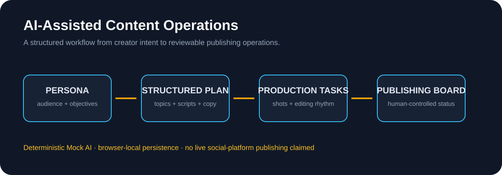

# AI-Assisted Influencer Content Operations Platform

A runnable workflow prototype that turns a creator persona into structured content planning, scripts, production tasks, and publishing operations.

**Status:** Public documentation package for a separately maintained runnable prototype with deterministic Mock AI and browser-local persistence. This repository commit is documentation-only; no production model quality or live social-platform integration is claimed.

**Role lens:** AI Product Management · Workflow Design · Rapid Prototyping · Frontend Product Delivery

## Case evidence: role / inputs / outputs / result / boundary

| | Portfolio proof |
|---|---|
| **My role** | Owned the six-step product workflow, output schemas, state/recovery design, Mock AI boundary and handoff from content idea to publishing operations. |
| **Inputs** | Fictional creator persona, audience context, content goals and campaign constraints. |
| **AI + system work** | Deterministic Mock AI returns structured analysis; each step validates and passes editable fields to the next step. |
| **Outputs** | Content pillars, monthly topics, script draft, production checklist, publishing board and task status. |
| **Result** | A reproducible documentation package and browser-local prototype contract that can be reviewed without pretending to have live model or platform results. |
| **Boundary** | No live social-platform publishing, creator-growth metrics, production LLM quality or public source migration is claimed. |

## Six-step workflow

    Persona
      ↓
    AI Analysis
      ↓
    Monthly Topics
      ↓
    Video Script
      ↓
    Production Plan
      ↓
    Publishing Board

The documented product closes the gap between “generate some copy” and the operational work required to produce, review, schedule, and publish content.

## What the documented prototype demonstrates

- persona and audience input;
- structured content pillars and audience analysis;
- four-week topic planning;
- 60–90 second script drafts;
- candidate titles and publishing copy;
- shot list, B-roll, subtitle focus, and editing rhythm;
- publishing board, task completion, and progress calculation;
- loading, empty, disabled, success, and recovery states;
- responsive/mobile navigation;
- browser-local persistence and demo-state recovery.

## AI boundary

The public demo uses deterministic Mock AI responses so the workflow is reproducible and easy to review. It does not claim production LLM quality, real creator-growth results, or live platform publishing.

A future model integration would require a provider abstraction, structured-output validation, retries and fallback, content-safety checks, user editing/approval, and observable failure handling.

## Product decisions

- Make the six-step chain visible so users understand how an idea becomes an executable plan.
- Keep AI outputs structured so each result can be edited and reused by the next step.
- Use deterministic fixtures to validate information architecture and state transitions before model quality is introduced.
- Treat publishing as an operational workflow with tasks and status, not as an automatic side effect.

## Evaluation plan

Current evaluation is based on deterministic fixture walkthroughs and local persistence checks. Production user metrics have not been collected.

Useful future metrics include time from persona input to first usable plan, six-step completion rate, percentage of generated fields requiring edits, script acceptance/edit distance, task completion rate, mobile task success, and persistence recovery success.

## Repository map

- [docs/product-brief.md](docs/product-brief.md) — target users, job to be done, and product scope
- [docs/workflow-and-output-contract.md](docs/workflow-and-output-contract.md) — six-step state model and structured outputs
- [docs/model-integration-plan.md](docs/model-integration-plan.md) — path from Mock AI to a real provider
- [docs/evaluation-and-limitations.md](docs/evaluation-and-limitations.md) — current evidence and non-production boundary
- [docs/synthetic-structured-output-example.md](docs/synthetic-structured-output-example.md) — fictional output contract example
- [docs/demo-script.md](docs/demo-script.md) — end-to-end walkthrough (when the runnable source is published)
- [docs/portfolio-evidence-index.md](docs/portfolio-evidence-index.md) — recruiter reading path and evidence status
- [THIRD-PARTY-NOTICES.md](THIRD-PARTY-NOTICES.md) — creator, media, and provider boundary

> Public portfolio material should use fictional creator identities, synthetic campaign information, and assets that are owned or licensed for publication. The existing public implementation context is maintained separately; any future source migration into this repo requires a fresh license and secrets review.
